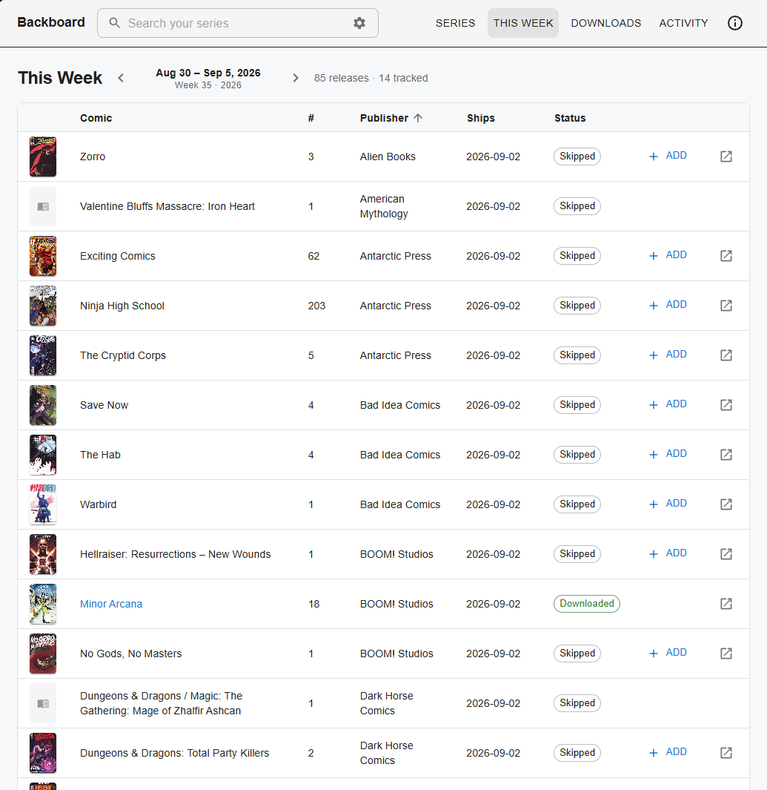
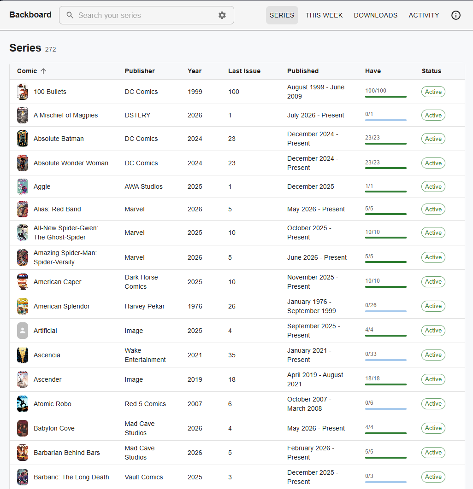
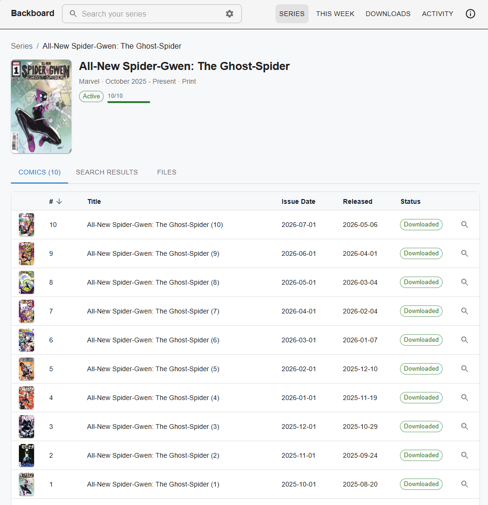
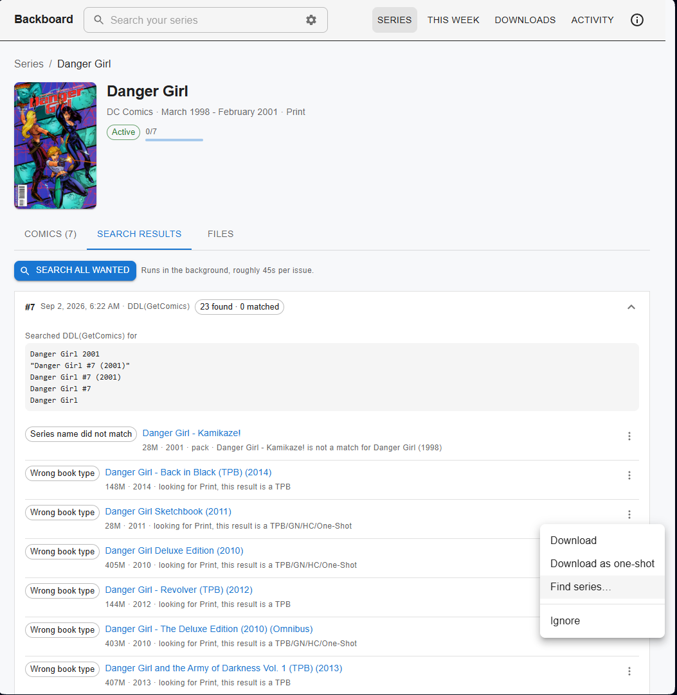
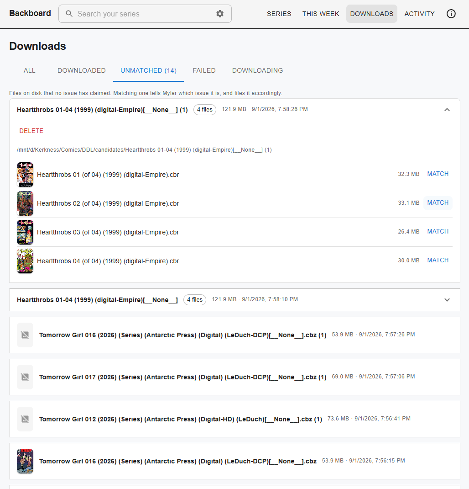

# Backboard screenshots

What the UI actually looks like, so you can decide whether it is for you before installing
anything. Mylar's own interface is unchanged and still available alongside this one.

[Back to the README](README.md)

---

## This Week

The weekly pull list, with cover art and the real date range for the week rather than a week
number. Series you already follow link straight through. Anything you do not follow can be
added from here in one click.

---

## Series

Your watchlist, with covers, publisher, completion and status in one view. The search box at
the top filters this list, and can also reach ComicVine for series you have not added yet.

---

## A single series

Every issue with its own cover, and its status at a glance. The tabs split what you have
(Comics) from what the searcher found (Search Results) and what is on disk (Files).

---

## Search results

This is the part that does not exist upstream. Mylar searches, rejects most of what it
finds, and logs the reasons. Backboard keeps them.

Each run records what it actually searched for, and every candidate it turned down with the
reason why: wrong book type, series name did not match, and so on. If the matcher was wrong,
the row menu lets you download it anyway, treat it as a one-shot, look the series up on
ComicVine, or ignore it for good.

---

## Unmatched downloads

Files that downloaded fine but that post-processing could not place. Rather than leaving
them in a staging folder for you to sort out by hand, they get their own tab with cover
previews, and you can match one against a chosen series and issue.

Empty folders left behind by successful post-processing are separated out, so the count
reflects real work rather than litter.

---

The interface is responsive, so all of the above works on a phone as well as a desktop
browser.
